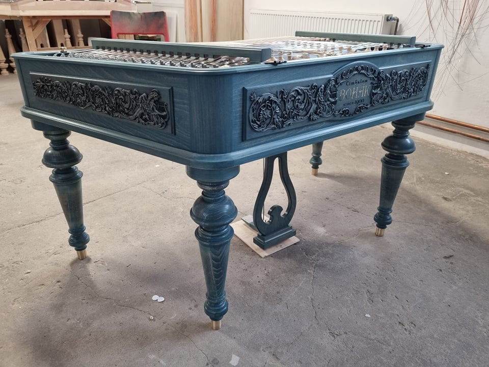

O firmě Bohák Manufactury
#########################

:date: 2021-11-24
:tags: about, firma
:category: info
:slug: o-firme
:author: Lukáš Růžička
:summary: Informace o firmě Bohák Manufactury
:status: published

Nazývajte nás gurmánmi hudby. My jednoducho veríme, že život chutí skvele a že naše zmysly sú dar, vďaka ktorému život dokážeme žiť krásne a naplno. Inšpirovať ľudí po celom svete a robiť ich šťastnými vychutnávaním si tých najlepších a najpoctivejších tónov cimbalovej hudby je to, čo nás ženie vpred.

Od roku 2013 na Slovensku pod Tatrami pokračujeme v starej maďarskej tradícii výroby cimbalov viac ako storočnej značky BOHÁK, ktorá je najobľúbenejšou značkou cimbalov vo svete.

Spoločnosť Cimbalom BOHÁK® sa zaoberá precíznou výrobou a predajom cimbalov značky BOHÁK a ostatného vybavenia tohto typu zameraného pre konzervatória, základné umelecké školy, folklórne súbory, známych i menej známych muzikantov.

Za súčasnou značkou sa skrýva veľké srdce, ktoré vkladáme do výroby každého cimbalu, hodiny kreativity, inovatívnych nápadov, ale aj úcta k tradícii predchádzajúcich majstrov.

Kvalitu našich cimbalov posúvame neustále vyššie. Staré postupy výroby dopĺňame novým modernými duchom, ktorý zaručuje neustále zvyšujúcu sa kvalitu, tak potrebnú pre moderného cimbalistu. Základom našej práce je teda inovovaná technológia pre dosiahnutie najvyšších kvalít zvukovej i estetickej stránky. Aj vďaka tomu sme, napríklad, tento rok prišli na trh s odľahčeným cimbalom.

Takmer všetky použité komponenty sú laboratórne testované a naše cimbaly sú vyrábané s osvedčeným certifikátom kvality.

Spolupracujeme s najlepšími umeleckými rezbármi, ktorí pre cimbaly BOHÁK vytvárajú prepracované rezby s pečaťou originality. Pre náročných klientov dokážeme vyrobiť luxusný cimbal, ktorý je nielen excelentným hudobným nástrojom, ale sa zároveň stáva skvostom – solitérom interiéru domu.

Drevo na výrobu cimbalov vyberáme podľa citu, nielen podľa vzhľadu a zvuku. A dušu, tú už musí každému nástroju vdýchnuť hudobník svojím majstrovstvom sám.

Našou veľkou snahou je podporiť hru na tento krásny nástroj u detí a mladej generácie. Aj preto vyrábame cimbaly cenovo dostupnejšie pre rodičov, pričom ponúkame aj splátkový systém.

